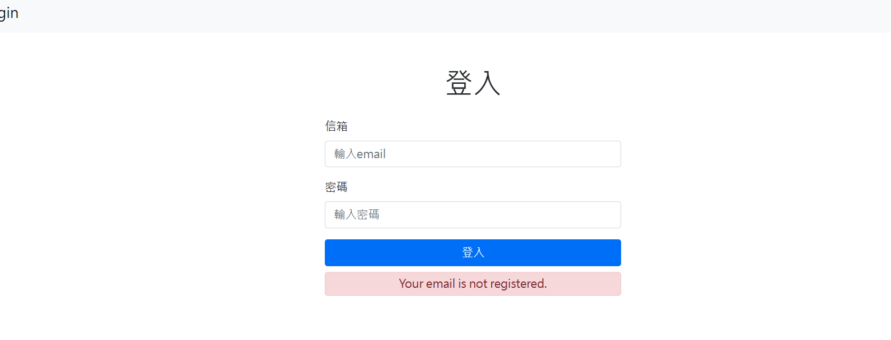

#登入系統


##功能
1. 使用者可以登入
2. 可以提示是未註冊or密碼錯誤

##如何使用
1. 先確認有安裝node.js & npm 
2. 將專案 clone 到本地
3. 透過終端機進入資料夾
```
cd login-systems
```
4.安裝相關套件
```
npm install
```
5.設定環境變數連線MongoDB
```
MONGODB_URI=mongodb+srv://<Your MongoDB Account>:<Your MongoDB Password>@cluster0.xxxx.xxxx.net/<Your MongoDB Table><?retryWrites=true&w=majority
```
6.將種子資料內容載入資料庫
```
npm run seed ；出現 Created! 表示載入成功。
```
7.啟動伺服器
```
npm run dev ；出現 App is running on http://localhost:3000 表示伺服器啟動成功
```

##開發工具
- Node.js@18.15.11
- dotenv@16.0.3
- express@4.18.2
- express-handlebars@4.0.2
- express-session@1.17.3
- mongoose@7.0.3